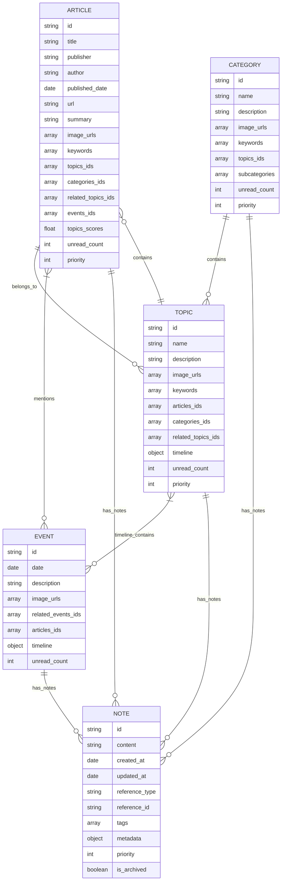

# News Reader Database Entity Relationship Diagram

## Enhanced Schema Explanation

### Main Entities

1. **ARTICLE**
   - Core entity storing news articles with unique ID
   - Contains metadata about the article (title, author, URL)
   - References to categories, topics, and events
   - Stores scoring metrics for relevance to topics
   - Tracks unread count and priority for reading recommendations

2. **TOPIC**
   - Represents a specific news topic (e.g., "Climate Change", "US Politics")
   - Contains a timeline of related events
   - Links to articles discussing this topic
   - Associates with categories
   - Tracks unread count and priority for reading recommendations

3. **CATEGORY**
   - High-level classification (e.g., "Politics", "Technology", "Sports")
   - Contains multiple topics and embedded subcategories
   - Used for broad organization of content
   - Subcategories stored as nested array within the category document
   - Tracks unread count and priority for reading recommendations

4. **EVENT**
   - Represents a specific news event with a date
   - Links to articles covering this event
   - Has its own timeline of sub-events or developments
   - Can be part of topic timelines
   - May relate to other events
   - Tracks unread count

5. **NOTE**
   - User-created annotations and thoughts while reading
   - Can be linked to any entity (Article, Topic, Category, or Event)
   - Contains free-form content with creation/update timestamps
   - Supports tagging for organization and search
   - Includes metadata for additional context or structured data
   - Can be prioritized and archived

### Improvements to Original Schema

1. Added unique ID to ARTICLE entity
2. Combined CATEGORY and SUBCATEGORY into a single entity with nested structure
   - Better suited for MongoDB's document-oriented structure
   - Subcategories stored as an array within the category document
3. Added unread_count and priority fields to all entities
   - Enables better reading recommendations and content prioritization
   - Helps track content consumption and importance
4. Added NOTE entity for reader annotations
   - Flexible reference system to link notes to any entity type
   - Support for tagging and metadata to enhance organization
   - Timestamps for tracking creation and updates
5. Added relationship cardinality to clarify connections
6. Structured events into a proper entity with relationships
7. Organized topic and event information with timeline support

## Version History

| Version | Date       | Changes Made                  |
|---------|------------|-------------------------------|
| 1.1     | 2025-04-12 | Removed unimplemented fields  |
|         |            | - events_scores from ARTICLE  |
|         |            | - priority from EVENT         |
| 1.0     | 2025-04-10 | Initial version               |
